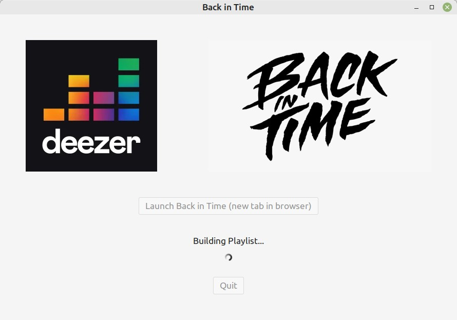
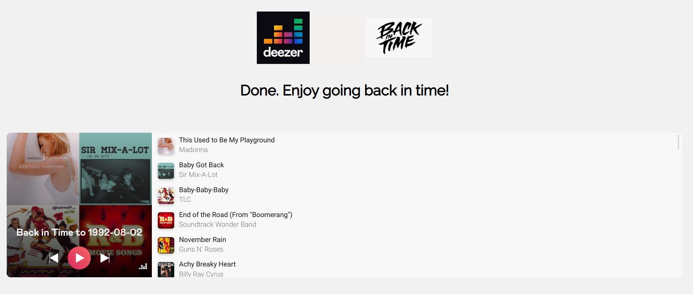

# Back in Time


[](https://pypi.python.org/pypi/redislite/)
[](https://www.python.org/dev/peps/pep-0008/)


[](https://opensource.org/licenses/MIT)

## Description

Are you feeling nostalgic? What about going back in time and reliving the top hits of a special date? 
Your birthday... wedding anniversary... your call! Choose a date and  **Back in Time** will prepare a 
playlist loaded with the hits of that special occasion, based on **Billboard Hot 100**.

You just need to hit play and relax.

Music streaming services supported: **Deezer**.

## Requirements

**Back in Time** requires Python 3.6 or higher.

### Installing requirements on Linux

Make sure Python development headers are available when installing **Back in Time**.

On Ubuntu/Debian systems, install them with:

```console
$ apt-get install python-dev
```

On Redhat/Fedora systems, install them with:

```console
$ yum install python-devel
```
    
## Installation

The recommended way to build and run **Back in Time** is using [pyinstaller](https://pyinstaller.org/en/stable/), as follows:

```console
$ git clone https://github.com/wsmenezes/back_in_time.git
$ pyinstaller back_in_time/__main__.py --onefile --clean --name back_in_time
```

Once it's done just run the binary file: 

```console
$ ./back_in_time
```

## Screenshots

##### App Launcher Interface

# 

##### Web app Interface

# 

## Development

For those exploring Python projects to learn something new or different, here follows a summary of the 
technologies and dev approach deployed in this project:

* **OOO** fundamentals and **REST API** consumption using the high regarded [requests](https://requests.readthedocs.io/en/latest/) Python library.
* **Oauth authentication** best practices.
* **Multiprocessing** implementation to enable **UI** and **web app** different code flows.
* **Web scraping** using [Beautiful Soup](https://www.crummy.com/software/BeautifulSoup/bs4/doc/).
* [Flask](https://flask.palletsprojects.com/en/2.2.x/) Python framework for the **web app** deployed.
* How to correctly define [Flask](https://flask.palletsprojects.com/en/2.2.x/) **endpoints**.
* Basic launcher application written in [GTK 3](https://www.gtk.org/) using [Glade](https://glade.gnome.org/).
* How to properly handle [GTK 3](https://www.gtk.org/) **templates** and **signals**.
* Cache mechanism between processes (**UI** and **flask**) powered by [redislite](https://github.com/yahoo/redislite), 
a self-contained Python interface to [Redis](https://redis.io/) key-value DB.
* Last but not least: how to enjoy music whilst developing! 🎶

## More Information

**Back in Time** is Free software under the MIT license, see [LICENSE.txt](./LICENSE.txt) for details.

### **Developed by**:


